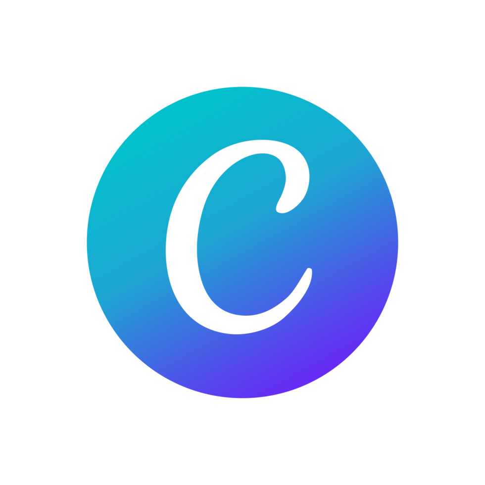

<h1 align="center">Hola 👋 soy Joan / joanferreyt </h1>

  
  
  
  
  

 

<h2>Sobre mí 😃</h2>

🎓 TÉCNICO SUPERIOR EN DESARROLLO DE APLICACIONES MULTIPLATAFORMA — actualmente cursando Realización de Proyectos Audiovisuales

🎥 CREADOR DE CONTENIDO en YouTube (@joanferreyt), donde comparto autosuperación y desarrollo personal con el mismo enfoque analítico que uso programando

💻 desarrollo de software: apps móviles, backends, automatización de procesos con Odoo

📝 roles: desarrollador... editor de vídeo... creador de contenido... y pronto realizador audiovisual

📫 Contacto: **[joanferrecontact@gmail.com](mailto:joanferrecontact@gmail.com)**

 

<h2>Tecnologías conocidas 👨🏻‍💻</h2>

  

<h2>Software de edición 🎬</h2>

  
  
  
  
  

 

<h2>Proyectos de código 👨🏻‍💻</h2>

<table align="left">
<tr border="none">
  <td width="25%" align="center">
    

      
    

    

      
    

  </td>
  <td width="25%" align="center">
    

      
    

    

      
    

  </td>
  <td width="25%" align="center">
    

      
    

    

      
    

  </td>
  <td width="25%" align="center">
    

      
    

    

      
    

  </td>
</tr>
</table>

 
  

<h2>Proyectos de vídeo 🎬</h2>

<table align="left">
<tr border="none">
  <td width="33%" align="center">
    

      
    

    

      
    

  </td>
  <td width="33%" align="center">
    

      
    

    

      
    

  </td>
  <td width="33%" align="center">
    

      
    

    

      
    

  </td>
</tr>
</table>

 
   

<h2 align="center">GitHub :octocat:</h2>

<table align="center">
<tr border="none">
<td width="60%" align="center">
  
</td>
<td width="40%" align="center">
  
</td>
</tr>
</table>

 

<h2 align="center">YouTube ▶️</h2>

  
  

Desarrollo con propósito, contenido con intención.

